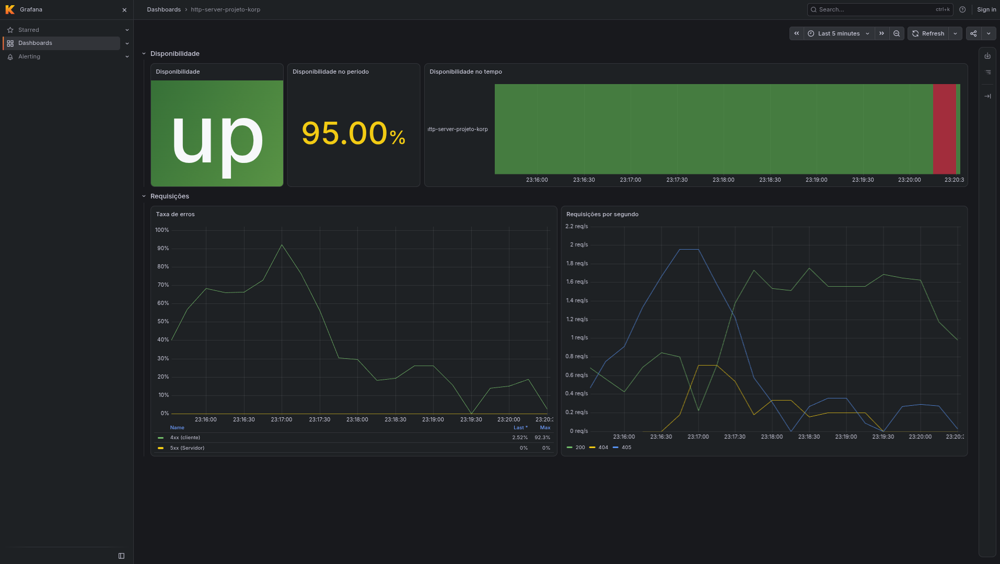
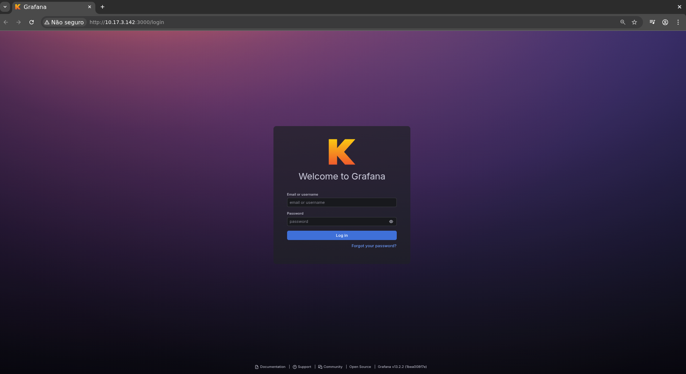

# Desafio Korp

Repositório dedicado ao teste técnico da vaga de DevOps da Korp.

Um serviço HTTP em Go executado em containers atrás de um proxy reverso NGINX, com monitoramento via Prometheus e Grafana. Todo o ambiente é provisionado por um único comando Ansible em uma VM Linux da família Debian, que pode ser criada via libvirt com Terraform ou já existir.



## Requisitos
Na máquina que executa o Ansible:
- ansible-core >= 2.17
- collection `community.docker` (instalada via `requirements.yml`)

No alvo:
- Debian ou Ubuntu com acesso SSH e permissão para usar o sudo

Opcional, para criar a VM:
- Terraform >= 1.5
- libvirt/QEMU (`qemu:///system`)

## Como utilizar

### VM (opcional)

O projeto precisa de uma VM com Debian ou Ubuntu instalada. Você pode provisionar ela via libvirt/QEMU com o terraform:

```sh
terraform -chdir=terraform init
terraform -chdir=terraform apply
```

O Terraform usa por padrão a chave em `~/.ssh/id_ed25519.pub` para permitir o acesso via SSH, para alterar isso pode utilizar `-var ssh_key=~/.ssh/outra.pub`. Também é possível alterar o tamanho do disco com `disk_size_gb`.

### Deploy

Após ter a VM provisionada, você deverá utilizar:
```sh
ansible-galaxy collection install -r ansible/requirements.yml

# Caso tenha sido provisionada por esse projeto via terraform
ansible-playbook ansible/deploy.yml

# Qualquer outra VM: troque pelo IP ou DNS (a vírgula no final é obrigatória)
ansible-playbook -i "10.17.3.42," -u debian ansible/deploy.yml

# Com senha: -k pede a do SSH (requer sshpass) e -K a do sudo
ansible-playbook -i "10.17.3.42," -u debian -k -K ansible/deploy.yml
```

O playbook instala o Docker a partir do repositório oficial, cria a rede, copia o projeto para `/opt/projeto-korp`, faz o build e sobe os containers. No fim, valida o serviço com uma requisição HTTP e exibe a resposta:

```
TASK [Exibir resposta do serviço] **********************************************
ok: [10.17.3.142] => {
    "msg": {
        "horario": "2026-09-30T00:18:37Z",
        "nome": "Projeto Korp"
    }
}

PLAY RECAP *********************************************************************
10.17.3.142                : ok=11   changed=0    unreachable=0    failed=0
```

### Rodando localmente, sem Ansible

```sh
docker network create projeto-korp
docker compose up -d --build
curl http://localhost:80/projeto-korp
```

## Serviços e Acessos

| Porta | Serviço |
|---|---|
| 80 | o serviço, via nginx |
| 3000 | Grafana, com o dashboard como página inicial |
| 9090 | Prometheus |

### Caminhos do serviço

| Caminho | Descrição |
|---|---|
| `GET /projeto-korp` | JSON com `nome` = `"Projeto Korp"` e `horario` = horário atual em UTC (RFC 3339) |
| `GET /metrics` | métricas no formato Prometheus; bloqueado no nginx (404), acessado só pelo Prometheus pela rede interna |
| `GET /healthz` | health check; responde 200 enquanto o serviço está ativo |


### Grafana

Provisionado por arquivos (datasource e dashboard), sem configuração manual. O acesso é anônimo e somente leitura; o admin usa as credenciais padrão do Grafana (`admin`/`admin`).

Um detalhe visual: o Grafana usa a logo da Korp no lugar da padrão (`grafana/Dockerfile`).



O dashboard `http-server-projeto-korp` tem 5 painéis:

- **Disponibilidade**
  - Disponibilidade: o serviço está de pé agora?
  - Disponibilidade no período: % de uptime no intervalo escolhido
  - Disponibilidade no tempo: em que momentos esteve disponível no intervalo
- **Requisições**
  - Taxa de erros: proporção de respostas 4xx e 5xx sobre o total
  - Requisições por segundo: por código HTTP, sem contar `/metrics` e `/healthz`

No print do dashboard, no topo, o trecho vermelho é o serviço derrubado de propósito para demonstrar a detecção de queda, e os erros 4xx vêm de requisições inválidas geradas para exercitar o painel.

## Testes

```sh
cd http-server && go test ./...
```

